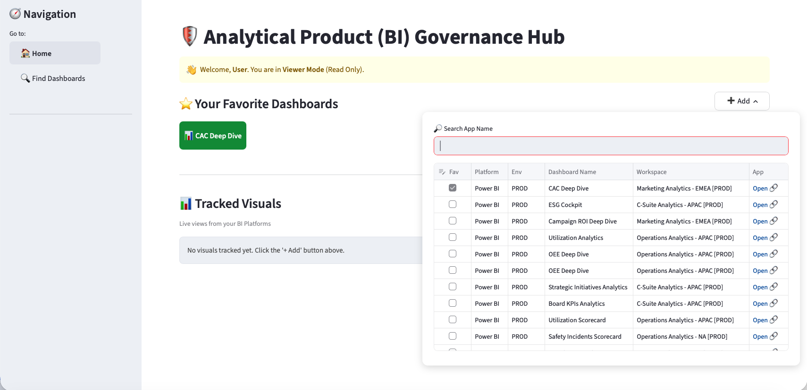
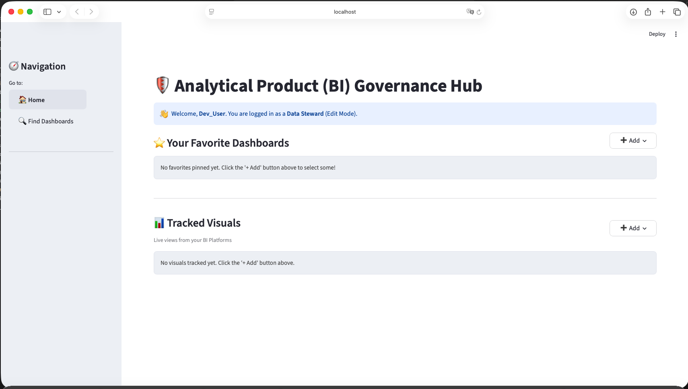
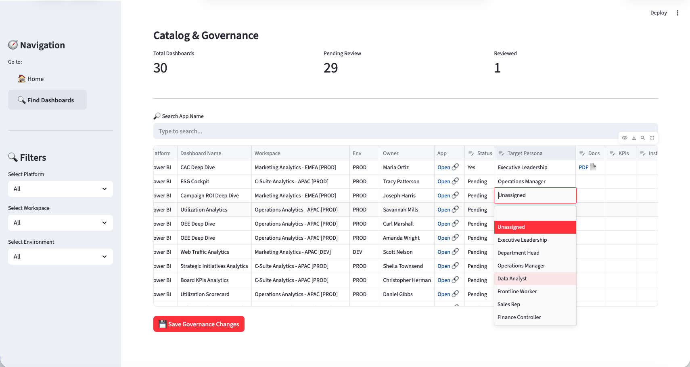

# 🛡️ Universal BI Governance Hub


A platform-agnostic Business Intelligence (BI) governance, cataloging, and auditing engine. Designed to combat "dashboard sprawl" across enterprise platforms (Power BI, Qlik, Tableau) by providing a single pane of glass for data stewards and business users.

---

## 📖 The Problem: Dashboard Sprawl
Modern enterprise environments utilize multiple BI platforms, leading to fragmented metadata and a "Wild West" of reporting. Finding the "certified" dashboard for a specific KPI, auditing user access routes, and tracking documentation links becomes a manual, cross-platform nightmare. 

Business users do not know which data to trust as the Single Source of Truth (SSOT), and Data Stewards lack the centralized tools to govern these assets effectively.

## 💡 The Solution
The **Universal BI Governance Hub** abstracts the extraction of BI metadata and centralizes governance workflows into a unified, interactive web application.

**Core Capabilities:**
* **Role-Based Access:** Automatically detects user roles, serving a read-only view for business users and an interactive "Edit Mode" for Data Stewards.
* **Interactive Catalog:** A unified directory of all BI assets filterable by Workspace, Environment, and Target Persona (e.g., "Executive Leadership").
* **Governance Workflows:** Allows Data Stewards to review dashboards, approve them for production, and link external KPI documentation directly from the UI.
* **Personalized Workspaces:** Users can pin their favorite dashboards and embed live iFrame visuals for quick daily tracking.

### 📸 Application Walkthrough

**1. The Personalized Home Page** Users are greeted with their pinned dashboards and live tracked visuals.  

**Main Dashboard View & Adding Favourites:**
<p align="center">
  
</p>

**2. The Data Steward Governance View** Stewards can filter unassigned dashboards, update approval statuses, and link documentation directly into the database.  

**Data Steward Catalog:**
<p align="center">
  
</p>

**Edit, Assign, or Approve Governance Rules:**
<p align="center">
  
</p>

## 🛣️ Future Roadmap

1. **Automated Policy Enforcement:** Implement scanning modules to check enterprise-specific rules, such as enforcing standard Naming Conventions, Workspace organization compliance, and semantic versioning of Analytical Products directly within the catalog.
2. **AI-Powered Governance Copilot (RAG):** Once the heavy lifting of centralizing KPI definitions, functional design documents, and work instructions is complete, integrate a Retrieval-Augmented Generation (RAG) agent. This will allow business users to interact with the governance documentation using natural language (e.g., *"How is the Blended CAC metric calculated in the Marketing Dashboard?"*).

---

## 🏗️ Architecture Decision Records (ADRs)

### ADR 001: The Extensible Provider Pattern
To ensure the engine is platform-agnostic, metadata ingestion uses an Object-Oriented Provider Pattern. 
* A `BaseBIExtractor` abstract base class defines the strict contract (e.g., `get_workspaces()`, `get_apps()`, `get_users()`).
* New BI tools are integrated simply by subclassing this base class and handling the specific REST API idiosyncrasies. 

### ADR 002: Medallion Architecture 
The data processing pipeline is modeled after the  Medallion Architecture:
* **Bronze (Raw):** Raw JSON arrays extracted from the BI Provider APIs.
* **Silver (Normalized):** Flattened, relational entities (`df_apps`, `df_workspaces`) structured via Pandas (locally) or PySpark (production).
* **Gold (Serving):** Business-level aggregates (e.g., `tbl_bi_catalog`). In local development, this is simulated using an embedded **SQLite** database.

### ADR 003: Synthetic Data Generation (Mocking)
To enable zero-friction local development and portfolio demonstrations without requiring live enterprise API credentials, this repository utilizes a `MockBIExtractor` powered by the `Faker` library. It maintains complex foreign key relationships to ensure SQL joins function identically to production without exposing proprietary company data.

---

## 🏢 Enterprise Deployment Parallels

While this repository is designed to run locally using synthetic data for demonstration purposes, the architecture is specifically designed to be swapped out for enterprise-grade cloud services. 

Here is how this application maps to an enterprise production environment (e.g., Azure & Databricks):

| Component | Local Demo (This Repo) | Enterprise Production Equivalent |
| :--- | :--- | :--- |
| **Metadata Ingestion** | Python `Faker` library (`mock.py`) | Databricks Workflows querying live Power BI / Qlik REST APIs |
| **Data Storage (Medallion)** | Local SQLite Database (`init_db.py`) | Databricks Delta Lake (Bronze, Silver, Gold tables) |
| **App Hosting** | Local Docker Desktop | Databricks Apps / Azure App Service for Containers (or AWS Fargate / Google Cloud Run) |
| **Future AI Engine (RAG)** | Local hardware via Ollama (LLaMA 3.2) | Enterprise Cloud APIs (Azure OpenAI / Databricks Model Serving) |
| **Authentication** | Hardcoded mock headers | Azure Active Directory (Entra ID) / SSO Integration |


---

## 🚀 Local Quickstart (Zero Configuration)

You can run this entire enterprise architecture locally in seconds. The mock engine will automatically generate a synthetic Power BI and Qlik environment for you.

### Option A: 1-Click Windows Startup (Recommended)
If you have Docker Desktop installed on Windows, simply double-click the included batch file. It will build the container, mount the volume, and launch the web browser automatically.
```bash
start_local.bat
```

### Option B: Standard Python Setup
Local Python installation is required.

#### 1. Set up the environment
```bash
python -m venv .venv
```
```bash
source .venv/bin/activate  # On Windows use: .venv\Scripts\activate
pip install -r requirements.txt
```

#### 2. Initialize the Medallion Pipeline (Builds local SQLite Gold database)
```bash
python app/init_db.py
```

#### 3. Launch the Governance UI
```bash
streamlit run app/main.py
```


---

## 🗂️ Project Structure
```bash
universal-bi-governance/
├── app/                                # Serving Layer
│   ├── init_db.py                      # Local ETL pipeline & SQLite builder
│   └── main.py                         # Streamlit interactive UI
├── databricks/                         # Production Cloud Pipeline (Stubs)
│   ├── 01_bronze_ingestion.py
│   ├── 02_silver_transformations.py
│   └── 03_gold_marts.py
├── extractors/                         # Data Extraction Layer (Provider Pattern)
│   ├── base.py                         # Abstract Base Class contract
│   └── mock.py                         # Faker-driven synthetic data provider
├── Dockerfile                          # Containerization config
├── requirements.txt                    # Python dependencies
└── README.md
```